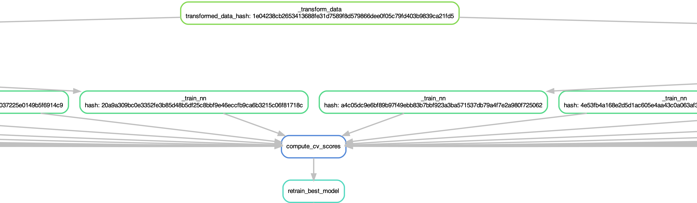
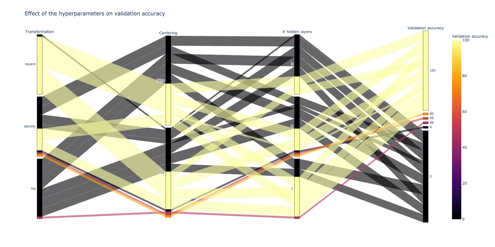

# Phyper

## TLDR;
*Avoid redundant computation, weird file naming and function arguments mess when developing machine learning pipelines which dependend on many hyperparameters. No documentation, but a complete working example, presented below.*

## Use case scenario

A machine learning pipeline may require training multiple models, which in turn usually depent on many hyperparamters, and also one may need to precompute intermediate resources depending on subsets of all the hyperparameters. Some hyperparameters should define a unique model, while others are just required to be specified for running the pipeline but should not lead to different storage of intermediate resources or model outputs. 

So, one needs to take care of:
* avoiding redundant computation due to the fact that some intermediate resources are shared among final models;
* naming resources/results to avoid naming collisions (and also in avoiding introducing weird inconsistent naming);
* passing around hyperparameters in the pipeline with various arguments which mirror the hyperparameters, which sometimes can create a messy code.

This simple package is meant to address the problems above.

Features:
* easy, convenient syntax for defining hyperparameters
* helper functions for using Snakemake as a pipeline manager (here the syntax is a bit more complex)
* use hyperparameters in any point within a pipeline, from data preprocessing to the final ML model
* IDE-enabled code completion for hyperparameters (tested with PyCharm)
* generating hashes for final outputs and intermediate resources to avoid redundant computations or resource clashing between different models; the hashes depend on a predefined subset of hyperparameters

## Acknowledgments
The library is partly inspired by `argparse` and `tap` (`typed argument parser`).

## A complete working example
The `phyper` package is fully presented in this [example](./example), in which I train on CPU three small neural networks on the Iris dataset.
For the sake of illustrating the functionalities, I perform some extra preprocessing steps on the data, depending on the choice of some hyperparameters.
I do a train/validation/test split to select the best networks under different choices of hyperparameters ($k$-fold cross-validation on the validation set, final model assessment on the test set).

I present the main points where `phyper` is helping making the code cleaner and more efficient.
### Running the whole pipeline
After installing the requirements, to run the whole pipeline it is just one command.
The pipeline will take advantage of core parallelism to preprocess the data, train all the models on all the hyperparameters, select the best model and retrain it.
`snakemake -j8 all`

### Defining and populating the hyperparameters (`config.py`)
#### Describing the hyperparameters and their default values
```python
import phyper

class NonKeys:
    n_epochs = 2000
    batch_size = 32
    learning_rate = 0.001
    log_interval = 200


class Instance(phyper.Parser, NonKeys):
    seed = 0
    n_hidden_layers = 3
    # to implement a k-fold cross-validation approach                
    cv_k = 5
    cv_fold = 0
    # possible values: 'identity' 'log', 'square'
    transformation = 'identity'
    # subtracting the mean after transformation
    centering = False
```
The hyperparameters defined into the superclass `NonKeys` are hyperparameters that, in our context, will not define unique models; on the contrary we want that different choices of the `Instance` hyperparameters will lead to dinstinct models.
#### Defining intermediate resources which depend on proper subsets of hyperparameters
```python
# each resource will lead to a unique path that will be stored here
parser = Instance(hashed_resources_folder='derived_data')

parser.register_new_resource(name='transformed_data', dependencies=['transformation'])
parser.register_new_resource(name='preprocessed_data', dependencies=['transformation', 'centering'])
parser.register_new_resource(
    name='cross_validated_model',
    dependencies=parser.get_dependencies_for_resources('preprocessed_data') + ['n_hidden_layers'])
```

#### Specifying the actual values of each instance
Values that are not specified assume the default value defined before
```python
d = {'transformation': ['identity', 'log', 'square'],
     'centering': [True, False],
     'n_hidden_layers': [1, 2, 3],
     'cv_fold': list(range(5))}

instances: List[Instance] = parser.get_instances_from_dictionary(d)
```

### Defining paths (`paths.py`)
The package ensure that each model or resource will be associated to a unique folder, named with a unique hash computed on the relevant hyperparameters values, the user then can specify paths to physically stored resources as follows. In this ways all paths are conveniently defined in just one location and in a consistent way.

```python
import os
from config import Instance


def get_torch_model_path(instance: Instance):
    return os.path.join(instance.get_resources_path(), 'torch_model.torch')


def get_training_metrics_path(instance: Instance):
    return os.path.join(instance.get_resources_path(), 'training_metrics.hdf5')


def get_transformed_dataset_path(instance: Instance):
    return os.path.join(instance.get_resources_path('transformed_data'), 'transformed_data.npy')


def get_preprocessed_dataset_path(instance: Instance):
    return os.path.join(instance.get_resources_path('preprocessed_data'), 'preprocessed_data.npy')
```

### Accessing the hyperparameter values of the instances
Here is an exampe of how the code in `train.py` is simplified by calling `train()` by passing just an `Instance` object, and by accessing paths taking advantage of `paths.py`.

```python
# ... (imports)

from paths import get_torch_model_path, get_training_metrics_path #, ...


def train(instance: Instance, train_also_on_validation_set=False):
    # Model is our neural network, and we pass hyperparameters by passing `instance`                
    model = Model(instance)
    # ...    
    # here we access the learning rate    
    optimizer = torch.optim.SGD(model.parameters(), lr=instance.learning_rate)

    # ...        
    for epoch in range(instance.n_epochs):
        model.train()
        # ...    
        # no need to mess around with weird path naming    
        path = get_torch_model_path(instance)            
        torch.save(model.state_dict(), path)
    # ...
```

### Projections, filtering and other operations ()
The library implements some common operations on list of instances (each specifying many hyperparameters), for instance projecting values to a subset of hyperparameters (and returning a pandas data frame), or filtering out instances that would be duplicate if considering a subset of hyperparameters.
Here is an example from `score_models.py`, with an overview of what the code is doing.

Each combination of the values of the hyperparameters `transformation`, `centering` and `n_hidden_layers` is associated to 5 different trained models, one for each value of the hyperparameter `cv_fold` (values 0, ..., 5).
The code below is finding all these sets of 5 models, it's reading from a file the validation_loss computed on each of them and averaging them.
Then it is saving the average loss in a pandas data frame which identifies models based on a hash which is automatically computed just on `transformation`, `centering` and `n_hidden_layers`, and not on `cv_fold`, which now is not relevant anymore.

```python
def compute_score_for_each_model(instances: List[Instance]):
    # cv_k is the same for all our instances
    cv_k = instances[0].cv_k
    # pandas df showing all the combinations of `transformation`, `centering` and `n_hidden_layers`        
    df = Instance.get_projections(instances, hyperparameter_names=instances[0].get_dependencies_for_resources(
        'cross_validated_model'))
    # to store the average losses    
    df_scores = pd.DataFrame(columns=['cross_validated_model_hash', 'average_validation_loss'])
    for _, row in df.iterrows():
        d = row.to_dict()
        # get instances whose hyperparameters match the one specified in the dictionary d        
        filtered_instances = Instance.get_filtered_instances(instances, d)
        # we expect to have extracted 5 instances, one for each of the 5 cross-validation folds
        assert len(filtered_instances) == cv_k
        # an extra integrity check
        assert set(Instance.get_projections(filtered_instances, ['cv_fold']).cv_fold.to_list()) == set(range(cv_k))
        average_validation_loss = 0
        for instance in filtered_instances:
            path = get_training_metrics_path(instance)
            with h5py.File(path, 'r') as f5:
                keys = f5.keys()
                # keys are like ['epoch10', 'epoch20', ...]
                last_epoch = get_last_epoch(keys)
                metrics = f5[f'epoch{last_epoch}']
                validation_loss = metrics['validation_loss'][...].item()
                average_validation_loss += validation_loss
        average_validation_loss /= cv_k
        # here we compute a hash which depends only on `transformation`, `centering` and `n_hidden_layers`    
        instance_hash = filtered_instances[0].get_instance_hash(resource_name='cross_validated_model')
        assert len(
            set([instance.get_instance_hash(resource_name='cross_validated_model') for instance in filtered_instances]))
        df_scores = df_scores.append(
            {'cross_validated_model_hash': instance_hash, 'average_validation_loss': average_validation_loss},
            ignore_index=True)
    path = get_cross_validation_scores_path()
    df_scores.to_csv(path)
```

### Integration with Snakemake
While before the goal was having a clean and easy to use syntax, now the goal is to provide an efficient parallel, non-redundant computation of instances and intermediate resources, by exploiting the full power of a pipeline manager like Snakemake. So, the focus is shifted from having a easy syntax. I tried to keep it clean, and in the future I may simplify it a bit more, if possible.

The pipeline is portrayed in the image.

The pipeline does the following: the data is preprocessed, 90 models are trained, cross-validation scores are compute from them and finally the best model is selected and retrained.

```snakemake
from config import instances, Instance
from paths import get_transformed_dataset_path, get_preprocessed_dataset_path, get_torch_model_path, \
    get_training_metrics_path, get_cross_validation_scores_path, get_best_model_torch_model_path, \
    get_best_model_training_metrics_path

rule _transform_data:
    output: Instance.snakemake_helper_get_wildcarded_path(get_transformed_dataset_path, instances[0], resource_name='transformed_data')
    shell: "python -m main transform-data --instance-hash {wildcards.transformed_data_hash}"

rule transform_data:
    input: expand(rules._transform_data.output, transformed_data_hash=Instance.get_instances_hashes(instances, resource_name='transformed_data'))

rule _preprocess_data:
    input:lambda wildcards: get_transformed_dataset_path(Instance.get_instance_from_hash(wildcards.preprocessed_data_hash, instances, resource_name='preprocessed_data'))
    output: Instance.snakemake_helper_get_wildcarded_path(get_preprocessed_dataset_path, instances[0], resource_name='preprocessed_data')
    shell: "python -m main preprocess-data --instance-hash {wildcards.preprocessed_data_hash}"

rule preprocess_data:
    input:expand(rules._preprocess_data.output, preprocessed_data_hash=Instance.get_instances_hashes(instances, resource_name='preprocessed_data'))

rule _train_nn:
    input: lambda wildcards: get_preprocessed_dataset_path(Instance.get_instance_from_hash(wildcards.hash, instances))
    output:
          Instance.snakemake_helper_get_wildcarded_path(get_torch_model_path, instances[0]),
          Instance.snakemake_helper_get_wildcarded_path(get_training_metrics_path, instances[0])
    shell:
         "python -m main train-model --instance-hash {wildcards.hash}"

rule train_nn:
    input: expand(rules._train_nn.output, hash=Instance.get_instances_hashes(instances))

rule compute_cv_scores:
    input: [get_training_metrics_path(instance) for instance in instances]
    output: get_cross_validation_scores_path()
    run:
        from score_models import compute_score_for_each_model

        compute_score_for_each_model(instances)

rule retrain_best_model:
    input: get_cross_validation_scores_path()
    output: get_best_model_torch_model_path(), get_best_model_training_metrics_path()
    shell:
         "python -m main train-best-model"

rule all:
    input: rules.retrain_best_model.output

# see the dependencies dag with
# snakemake --dag --forceall dag | dot -Tpdf > graph.pdf; open graph.pdf
rule dag:
    # input: expand(rules._train_nn.output, hash=Instance.get_instances_hashes([instances[0]]))
    input: rules.all.input
```

### Results
`phyper` is finally used to retrieve the results which have been stored by the pipeline. This is done in the `notebooks/results.ipynb` notebook, in which I also do some plots to verify the model performance and the dependence of the loss and the accuracy on the hyperparameters.

